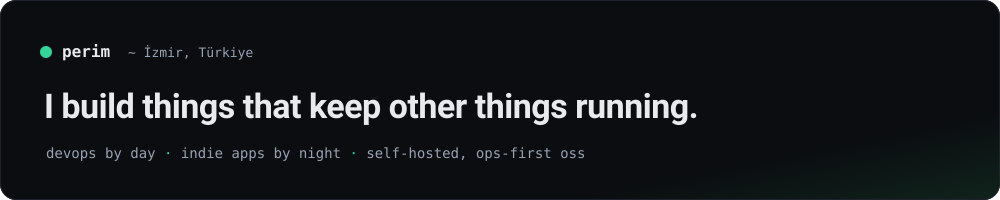

### İsmail Perim

Senior DevOps engineer in İzmir, Türkiye — 14+ years of infrastructure, monitoring and
backends. By night: indie iOS apps and self-hosted, ops-first open source.

#### Building

- [**briefd**](https://github.com/ismailperim/briefd)  — your agents, briefed: git-backed team knowledge served as token-budgeted MCP bundles
- [**oncallmate**](https://github.com/ismailperim/oncallmate)  — autonomous AI SRE agent that investigates Docker incidents while you sleep
- [**prompilot**](https://github.com/ismailperim/prompilot)  — chat-driven Prometheus visualization with one-click Grafana export
- [**directo**](https://github.com/ismailperim/directo)  — your services and operational links in one YAML-configured dashboard
- [**kareya**](https://github.com/ismailperim/kareya)  — open-source AI web agency: voice consultant in, real Astro code out
- [**reportcast**](https://github.com/ismailperim/reportcast)  — nobody reads your reports, but they'll listen

#### Shipped

iOS/macOS apps on the stores: **iotz** · **Upti** · **CertWarden** · **Fayn** · **PromBar**

#### Elsewhere

[perim.net](https://perim.net) · [Medium (TR)](https://ismailperim.medium.com) · [LinkedIn](https://www.linkedin.com/in/ismailperim/)
